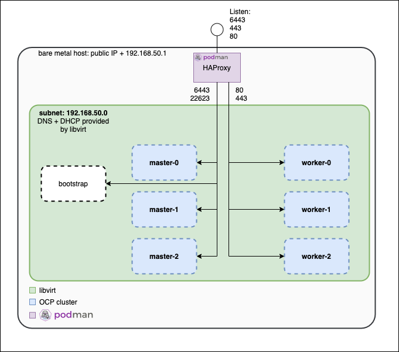

# Disclaimer
This environment has been created for the sole purpose of providing an easy to deploy and consume a Red Hat OpenShift Container Platform 4 environment *as a sandpit*.

This install will create a 'Minimal Viable Setup', which anyone can extend to
their needs and purpose.

Recent tests shows that SSD storage on the Server might be required for any persistent deployment to work correctly.

Use it at your own please and risk!

# Release notes

[Release notes](docs/release-notes.md)

# Contribution
If you want to provide additional features, please feel free to contribute via pull requests or any other means.

We are happy to track and discuss ideas, topics and requests via [Issues](https://github.com/RedHat-EMEA-SSA-Team/hetzner-ocp4/issues).


# Install Instructions

Our instructions are based on the CentOS Root Server as provided by https://www.hetzner.com/ , please feel free to adapt it to the needs of your preferred hosting provider. We are happy to get pull requests for an updated documentation, which makes consuming this setup easy also for other hosting providers.

**These instructions are for running CentOS and 'root' machines which is setup following [Hetzner CentOS](docs/hetzner.md) documentation. You might have to modify commands if running on another Linux distro.  Feel free to provided instructions for providers.**

**NOTE: If you are running on other environments than bare metal servers from Hetzner, check if there is specific instruction under Infra providers list and then jump to section [Initialize tools](https://github.com/RedHat-EMEA-SSA-Team/hetzner-ocp4#initialize-tools)   

** Supported root server operating systems: **
- CentOS 8
- RHEL 8 - How to install RHEL8: https://keithtenzer.com/2019/10/24/how-to-create-a-rhel-8-image-for-hetzner-root-servers/

## Infra providers
* [Hetzner CentOS](docs/hetzner.md)

When following below instructional steps, you will end with a setup similar to



## In case of Red Hat Enterprise Linux 7

Subscrip your RHEL Host:
```
subscription-manager register

subscription-manager attach --pool=...

subscription-manager repos --disable=*

subscription-manager repos \
    --enable="rhel-7-server-rpms" \
    --enable="rhel-7-server-extras-rpms" \
    --enable="rhel-7-server-ansible-2.8-rpms" \
    --enable="rhel-7-server-ose-4.2-rpms" \
    --enable="rhel-7-server-openstack-14-rpms"
```

## In case of Red Hat Enterprise Linux 8

Subscrip your RHEL Host:
```
subscription-manager register

subscription-manager attach --pool=...

subscription-manager repos --disable=*

subscription-manager repos \
    --enable=rhel-8-for-x86_64-baseos-rpms \
    --enable=rhel-8-for-x86_64-appstream-rpms \
    --enable=rhel-8-for-x86_64-highavailability-rpms \
    --enable=ansible-2.9-for-rhel-8-x86_64-rpms \
    --enable=openstack-15-for-rhel-8-x86_64-rpms
```

## In case of Centos 8

Enable ansible repo:
```
yum install -y centos-release-ansible-29.noarch
```

## Initialize tools

Install ansible (min version 2.8) and git

```
[root@server ~]# yum install -y ansible git
```

You are now ready to clone this project to your CentOS system.

```
[root@server ~]# git clone https://github.com/RedHat-EMEA-SSA-Team/hetzner-ocp4.git
```

We are now ready to install `libvirt` as our hypervisor, provision VMs and prepare those for OCP.

## Define variables for your cluster

Here is an example about [_cluster.yml_](cluster-example.yml) file that contains information about the cluster that is going to be installed.

| variable | describtion  |
|---|---|
|cluster_name  |Name of the cluster to be installed |
|public_domain  |Root domain that will be used for your cluster.  |
|public_ip  |Override for public ip entries. defaults to `hostvars['localhost']['ansible_default_ipv4']['address']`. |
|dns_provider  |DNS provider, value can be _route53_, _cloudflare_,_gcp_ or _none_. Check __Setup public DNS records__ for more info. |
|letsencrypt_account_email  |Email address that is used to create LetsEncrypt certs. If _cloudflare_account_email_ is not present for CloudFlare DNS recods, _letsencrypt_account_email_ is also used with CloudFlare DNS account email |
|image_pull_secret|Token to be used to authenticate to the Red Hat image registry. You can download your pull secret from https://cloud.redhat.com/openshift/install/metal/user-provisioned |

## Pre-releases

[Read this if you want to deploy pre releases](docs/ocp-pre-release.md)

### Setup public DNS records

Current tools allow use of three DNS providers: _AWS Route53_, _Cloudflare_, _GCP DNS_ or _none_.
If you want to use _Route53_, _Cloudflare_ or _GCP_ as your DNS provider, you have to add a few variables. Check the instructions below.

DNS records are constructed based on _cluster_name_ and _public_domain_ values. With above values DNS records should be
- api._cluster_name_._public_domain_
- \*.apps._cluster_name_._public_domain_

If you use another DNS provider, feel free to contribute. :D

With `dns_provider: none` the playbooks will not create public dns entries. (It will skip letsencrypt too) Please create public dns entries if you want to access your cluster. 

Please configure in `cluster.yml` all necessary credentials:

| DNS provider | Variables  |
|---|---|
|CloudFlare|`cloudflare_account_email: john@example.com` <br> Use the global api key here! (API-Token is not supported!) (Details in #86) <br>`cloudflare_account_api_token: 9348234sdsd894.....` <br>  `cloudflare_zone: domain.tld`|
|Route53 / AWS|`aws_access_key: key` <br/>`aws_secret_key: secret` <br/>`aws_zone: domain.tld` <br/>|
|GCP|`gcp_project: project-name `<br/>`gcp_managed_zone_name: 'zone-name'`<br/>`gcp_managed_zone_domain: 'example.com.'`<br/>`gcp_serviceaccount_file: ../gcp_service_account.json` |
|none|With `dns_provider: none` the playbooks will not create public dns entries. (It will skip letsencrypt too) Please create public dns entries if you want to access your cluster.|

### Optional configuration

|Variable | Default | Description |
|---|---|---|
|`storage_nfs`|false|Install NFS Storage with dynamic provisioning|
|`vm_autostart`|false|Create cluster VMs with `autostart` enabled|
|`auth_redhatsso`|empty|Install Red Hat SSO, checkout  [_cluster-example.yml_](cluster-example.yml) for an example |
|`auth_htpasswd`|empty|Install htpasswd, checkout  [_cluster-example.yml_](cluster-example.yml) for an example |
|`auth_github`|empty|Install GitHub IDP, checkout  [_cluster-example.yml_](cluster-example.yml) for an example |
|`cluster_role_bindings`|empty|Setup cluster role binding, checkout  [_cluster-example.yml_](cluster-example.yml) for an example |
|`openshift_install_command`|[check defaults](ansible/roles/openshift-4-cluster/defaults/main.yml)|Important for air-gapped installation. checkout [docs/air-gapped.md](docs/air-gapped.md)|
|`install_config_additionalTrustBundle`|empty|Important for air-gapped installation. checkout [docs/air-gapped.md](docs/air-gapped.md)
|`install_config_imageContentSources`|empty|Important for air-gapped installation. checkout [docs/air-gapped.md](docs/air-gapped.md)
|`letsencrypt_disabled`|`false`|This allows you to disable letsencrypt setup. (Default is enabled letsencrypt.)

## Prepare kvm-host and install OpenShift

```
[root@server ~]# cd hetzner-ocp4
[root@server ~]# ansible-playbook ./ansible/setup.yml
```

# Additional documentation

* [How to install and manage more than one OpenShift Cluster with  hetzner-ocp4](docs/multi-cluster-guide.md)
* [How to install an air-gapped cluster with hetzner-ocp4](docs/air-gapped.md)
* [How to install an proxy cluster with hetzner-ocp4](docs/proxy.md)
* [How to setup a container native virtualization lab (nested) with hetzner-ocp4](docs/cnv.md)
* [How to install an OpenShift nighly or RC (any kind of pre-release)](docs/ocp-pre-release.md)
* [Disk management (add disk to vm, wipe node)](docs/disk-management.md)
* [How to passthrough nvme or gpu (pci-passthrough](docs/pci-passthrough.md)

# Useful commands

| Problem | Command |
|---|---|
|Check haproxy connections| ```podman exec -ti openshift-4-loadbalancer-demo ./watch-stats.sh```
|Start cluster after reboot|```./ansible/04-start-cluster.yml```
