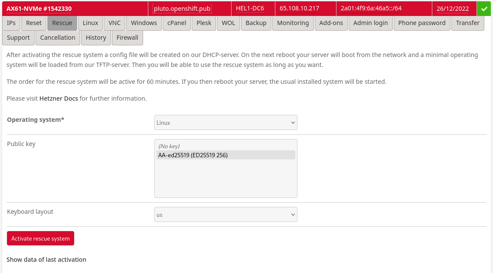

# Disclaimer
This environment has been created for the sole purpose of providing an easy to deployment and consume Red Hat OpenShift Container Platform 4 environment *as a sandpit*.

This install will create a 'Minimal Viable Setup', which anyone can extend to
their needs and purpose.

Use at your own please and risk!

# Contribution
If you want to provide additional feature, please feel free to contribute via
pull requests or any other means.
We are happy to track and discuss ideas, topics and requests via 'Issues'.


# Install Instructions

**NOTE: If you are running on other environment that bare metal servers from Hetzner. Jump directly to section [Initliaze tools](https://github.com/RedHat-EMEA-SSA-Team/hetzner-ocp4#initialize-tools). These instructions are for running CentOS and 'root' machines. You might have to modify command if running on other Linux ditro.**

When following these instructional steps, you will end with a setup similar to


## Installing The Root-Server
NOTE: Our instructions are based on the Root-Server as provided by https://www.hetzner.com/ , please feel free to adapt it to the needs of your preferred hosting provider. We are happy to get pull requests for an updated documentation, which makes consuming this setup easy also for other hosting provider.

When you get your server you get it without OS and it will be booted to rescue mode where you decide how it will be configured.

When you login to machine it will be running Debian based rescure system and welcome screen will be something like this

NOTE: If your system is not in rescue mode anymore, you can activate it from https://robot.your-server.de/server. Select your server and "Rescue" tab. From there select Linux, 64bit and public key if there is one.



This will delete whatever you had on your system earlier and will bring the machine into it's rescue mode.
Please do not forget your new root password.


After resetting your server, you are ready to connect to your system via ssh.


When you login to your server, the rescue system will display some hardware specifics for you:

```
-------------------------------------------------------------------

  Welcome to the Hetzner Rescue System.

  This Rescue System is based on Debian 8.0 (jessie) with a newer
  kernel. You can install software as in a normal system.

  To install a new operating system from one of our prebuilt
  images, run 'installimage' and follow the instructions.

  More information at http://wiki.hetzner.de

-------------------------------------------------------------------

Hardware data:

   CPU1: Intel(R) Core(TM) i7 CPU 950 @ 3.07GHz (Cores 8)
   Memory:  48300 MB
   Disk /dev/sda: 2000 GB (=> 1863 GiB)
   Disk /dev/sdb: 2000 GB (=> 1863 GiB)
   Total capacity 3726 GiB with 2 Disks

Network data:
   eth0  LINK: yes
         MAC:  6c:62:6d:d7:55:b9
         IP:   46.4.119.94
         IPv6: 2a01:4f8:141:2067::2/64
         RealTek RTL-8169 Gigabit Ethernet driver
```

From these information, the following ones are import to note:
* Number of disks (2 in this case)
* Memory
* Cores

Guest VM setup uses "root" vg0 volume group for guest. So leave as much as possible free space on vg0.

`installimage` tool is used to install CentOS. It takes instructions from a text file.

Create new `config.txt` file
```
[root@server ~]# vi config.txt
```

Copy below content to that file as an template

```
DRIVE1 /dev/sda
DRIVE2 /dev/sdb
SWRAID 1
SWRAIDLEVEL 1
BOOTLOADER grub
HOSTNAME CentOS-76-64-minimal
PART /boot ext3     512M
PART lvm   vg0       all

LV vg0   root   /       ext4     200G
LV vg0   swap   swap    swap       5G
LV vg0   tmp    /tmp    ext4      10G
LV vg0   home   /home   ext4      40G


IMAGE /root/.oldroot/nfs/install/../images/CentOS-76-64-minimal.tar.gz
```


There are some things that you will probably have to changes
* Do not allocated all vg0 space to `/ swap /tmp` and `/home`.
* If you have a single disk remove line `DRIVE2` and lines `SWRAID*`
* If you have more than two disks add `DRIVE3`...
* If you don't need raid just change `SWRAID` to `0`
* Valid values for `SWRAIDLEVEL` are 0, 1 and 10. 1 means mirrored disks
* Configure LV sizes so that it matches your total disk size. In this example I have 2 x 2Tb disks RAID 1 so total disk space available is 2Tb (1863 Gb)
* If you like you can add more volume groups and logical volumes.

When you are happy with file content, save and exit the editor via `:wq` and start installation with the following command

```
[root@server ~]# installimage -a -c config.txt
```

If there are error, you will be informed about then and you need to fix them.
At completion, the final output should be similar to


You are now ready to reboot your system into the newly installed OS.

```
[root@server ~]# reboot now
```

## Initialize tools

Install ansible and git

```
[root@server ~]# yum install -y ansible git
```

You are now ready to clone this project to your CentOS system.

```
[root@server ~]# git clone https://github.com/RedHat-EMEA-SSA-Team/hetzner-ocp4.git
```

We are now ready to install `libvirt` as our , provision VMs and prepare those for OCP.

## Define variables for your cluster

Here is an example about cluster.yml file that contains information about cluster that is going to be installed.

```
cluster_name: ocp4
public_domain: ocp.ninja
dns_provider: [route53|cloudflare]
image_pull_secret: |-
  asdfghfdsa
```

| variable | describtion  |
|---|---|
|cluster_name  |Name of the cluster to be installed |
|public_domain  |Root domain that will be used for your cluster.  |
|dns_provider  |DNS provider, value can be route53 or bind. Bind references local bind on root server. If using route53 you need to store AWS key and secret as env vars. Check Setup public DNS records for more info. |
|image_pull_secret|Token to be used to authenticate to Red Hat image registry. You can download pull secret from https://cloud.redhat.com/openshift/install/metal/user-provisioned |


DNS records are constructed based on cluster_name and public_domain values. With above values DNS records should be
- api.ocp4.ocp.ninja
- api-int.ocp4.ocp.ninja
- \*.apps.ocp4.ocp.ninja


```
[root@server ~]# vi hetzner-ocp4/cluster.yml
```

## Setup public DNS records

Current tools allow use of three DNS providers; AWS Route53, Cloudflare and bind. If you want to use Route53 or Cloudflare as your DNS provider you have to export few env variables. Check instructions below.  If you are not using public DNS, but bind just jump to next section.

If you use other DNS provider feel free to contribute. :D

### AWS Route 53

```
[root@server ~]# export AWS_ACCESS_KEY_ID=key...
[root@server ~]# export AWS_SECRET_ACCESS_KEY=secret...
```

### CloudFlare

```
[root@server ~]# export CLOUDFLARE_ACCOUNT_EMAIL=john@example.com
[root@server ~]# export CLOUDFLARE_ACCOUNT_API_TOKEN=9348234sdsd894.....
[root@server ~]# export CLOUDFLARE_ZONE="domain.tld"
```

## Prepare install and install Openshift

```
[root@server ~]# cd hetzner-ocp4
[root@server ~]# ansible-playbook  ansible/setup.yml
```

## Follow installation progress

First follow bootstrap process and then install process. bootstrap VM will be shutdown after bootstrap is completed.

```
[root@server ~]# ../terraform/post-terraform.sh
```

## Post install tasks

### Storage for registry

Image registry needs some level storage, following command set emptyDir storage to registry

```
[root@server ~]# oc patch configs.imageregistry.operator.openshift.io cluster --type merge --patch '{"spec":{"storage":{"emptyDir":{}}}}'
```

### Enable htpasswd based authentication

To add htpasswd file based authentication, follow Openshift documentation. https://docs.openshift.com/container-platform/4.1/authentication/identity_providers/configuring-htpasswd-identity-provider.html
