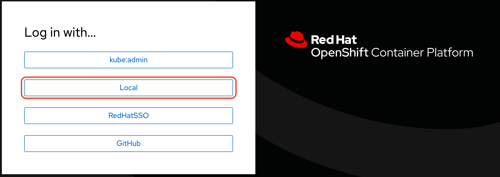

# Authentication with local user accounts

Some notes how you create hashed password for local user accounts in **cluster.yaml**.

## 1. Install package

```
# dnf install httpd-tools
```

## 2. Create hashed passwords

```
# htpasswd -c -B ./users.htpasswd admin
# htpasswd -B ./users.htpasswd local

# grep admin htpasswd.user | cut -f2 -d:
# grep local htpasswd.user | cut -f2 -d:
```

## 3. Replace passwords after the line "auth_htpasswd:"
```
auth_htpasswd:
  - admin:<new password 1>
  - local:<new password 2>
```
*Note: Don't forget the two spaces before - (minus).


