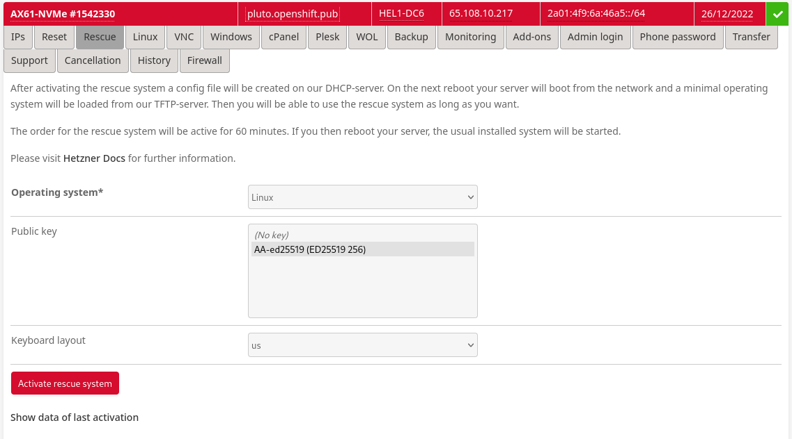
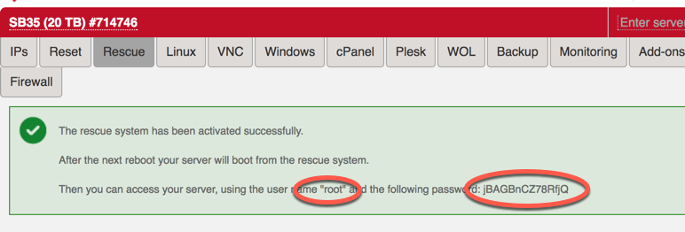
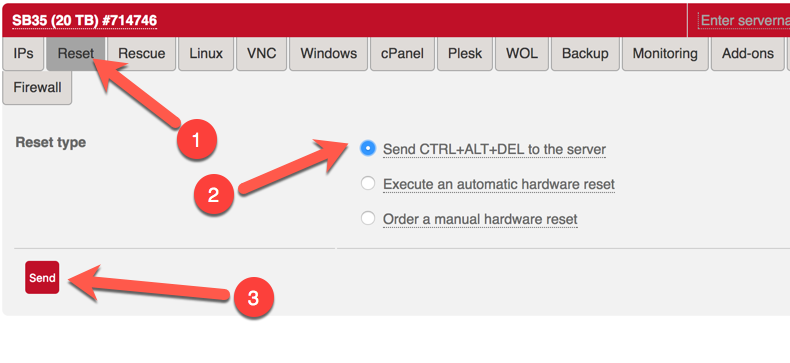
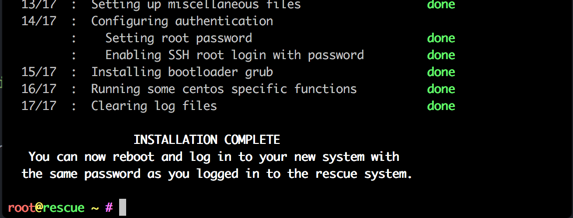

## Setup Hetzner root server

When you get your server you get it without OS and it will be booted to rescue mode where you decide how it will be configured.

When you login to the machine, it will be running a Debian based rescure system and a welcome screen will be something like this

NOTE: If your system is not in rescue mode anymore, you can activate it from https://robot.your-server.de/server. Select your server and "Rescue" tab. From there select Linux, 64bit and public key if there is one.



This will delete whatever you had on your system earlier and will bring the machine into it's rescue mode.
Please do not forget your new root password.



After resetting your server, you are ready to connect to your system via ssh.



When you login to your server, the rescue system will display some hardware specifics for you:

```
-------------------------------------------------------------------

  Welcome to the Hetzner Rescue System.

  This Rescue System is based on Debian 8.0 (jessie) with a newer
  kernel. You can install software as in a normal system.

  To install a new operating system from one of our prebuilt
  images, run 'installimage' and follow the instructions.

  More information at http://wiki.hetzner.de

-------------------------------------------------------------------

Hardware data:

   CPU1: Intel(R) Core(TM) i7 CPU 950 @ 3.07GHz (Cores 8)
   Memory:  48300 MB
   Disk /dev/nvme0n1: 2000 GB (=> 1863 GiB)
   Disk /dev/nvme0n1: 2000 GB (=> 1863 GiB)
   Total capacity 3726 GiB with 2 Disks

Network data:
   eth0  LINK: yes
         MAC:  6c:62:6d:d7:55:b9
         IP:   46.4.119.94
         IPv6: 2a01:4f8:141:2067::2/64
         RealTek RTL-8169 Gigabit Ethernet driver
```

From these information, the following ones are import to note:
* Number of disks (2 in this case)
* Memory
* Cores

The guest VM setup uses a "root" vg0 volume group for guest. So leave as much as possible free space on vg0.

The `installimage` tool is used to install CentOS. It takes instructions from a text file.

If you like to install Red Hat Enterprise Linux, create your own RHEL Image.  Follow the instructions of how you create an RHEL image for Hetzner:
* [Red Hat Enterprise Linux 8](https://keithtenzer.com/2019/10/24/how-to-create-a-rhel-8-image-for-hetzner-root-servers/)


Create a new `config.txt` file
```
[root@server ~]# vi config.txt
```

Copy below content to that file as an template

```
DRIVE1 /dev/nvme0n1
DRIVE2 /dev/nvme1n1
SWRAID 1
SWRAIDLEVEL 0
BOOTLOADER grub
HOSTNAME my-cool-hostname
PART /boot ext3     512M
PART lvm   vg0       all

LV vg0   root   /       ext4      50G
LV vg0   swap   swap    swap       5G
LV vg0   tmp    /tmp    ext4      10G
LV vg0   home   /home   ext4      40G
LV vg0   var    /var ext4 50G
LV vg0   libvirt /var/lib/libvirt/images xfs all


IMAGE /root/.oldroot/nfs/install/../images/CentOS-80-stream-amd64-base.tar.gz
```


There are some things that you will probably have to change
* Do not allocate all vg0 space to `/ swap /tmp` and `/home`.
* If you have a single disk,remove line `DRIVE2` and lines `SWRAID*`
* If you have more than two disks, add `DRIVE3`...
* If you need raid, just change `SWRAID` to `1`
* Valid values for `SWRAIDLEVEL` are 0, 1 and 10. 1 means mirrored disks
* Configure LV sizes so it matches your total disk size. In this example I have 2 x 2Tb disks RAID 1 so total disk space available is 2Tb (1863 Gb)
* If you like, you can add more volume groups and logical volumes.

When you are happy with the file content, save and exit the editor via `:wq` and start installation with the following command

```
[root@server ~]# installimage -a -c config.txt
```

If there are errors, you will be informed about them and you need to fix them.
At completion, the final output should be similar to



You are now ready to reboot your system into the newly installed OS.

```
[root@server ~]# reboot now
```

### Optional: Install hetzer server via ansible

If you do not want to do the above steps by hand: use Ansible! :-)

1) Create a `cluster.yml` in the repo's root folder and add your Hetzner server specifc information, as in the following example:
    ```
   hetzner_webservice_username: "USERNAME"
   hetzner_webservice_password: "PASSWORD"
   hetzner_hostname: "HOSTNAME"
   hetzner_ip: "IP_ADDRESS"
    ```

   More detailed information about the configurable parameters can be found in the [defaults variable file](../ansible/roles/provision-hetzner/defaults/main.yml)

2) Run playbook: `ansible/00-provision-hetzner.yml`

   Assuming you protected the SSH private key for logging into your Hetzner server with a password, you should use the ssh-agent for calling the Ansible playbook, so that the password for the SSH key is requested once and then stored for the entire session (so that you don't need to enter your password multiple times). The full playbook call from the repo's root folder (using the standard private SSH key name `id_rsa`) would then look like this:

   ```
   ssh-agent bash
   ssh-add ~/.ssh/id_rsa
   ansible-playbook ansible/00-provision-hetzner.yml
   ```
