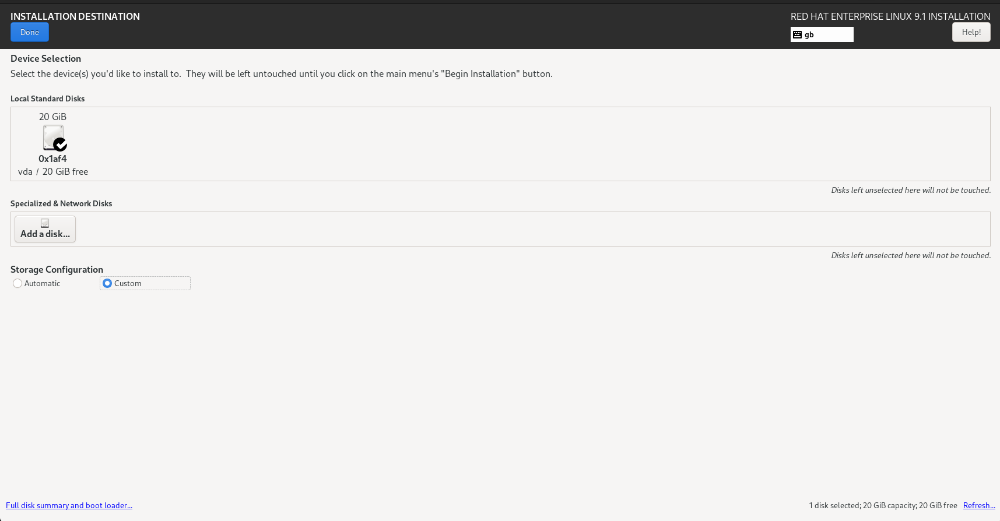
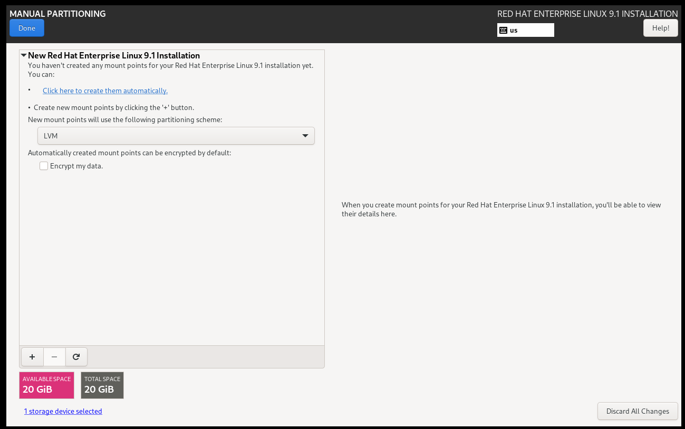

## How to install RHEL 9 and use it as Hetzner base image

### Download the image and install a RHEL-9-minimal virtual machine

Download the RHEL 9.1 DVD image from [Red Hat Customer Portal](https://access.redhat.com/downloads/content/479/ver=/rhel---9/9.1/x86_64/product-software)

Create a virtual machine and boot from the downloaded ISO. Once the `Anaconda Installer` is loaded, adjust settings as required. The recommended adjustments are `minimal` software selection and specific filesystem layout. For all other options, the defaults are sufficient.

Adjust the filesystem layout to be more compatible with automation of this repository.

Open the disk installation destination dialog and select `Custom` under the `Storage Configuration` section.


Hit the Done button. Confirm that `New mount points will use the following partitioning scheme` says LVM and then select the `Click here to create them automatically` text.


Once created, change the volume group for `root` and `swap` logical volume to `vg0`. Select `Volume Group` Drop down, if vg0 does not exist `Create new volume group`.


When finished, it will look like this.


Press Done. Accept changes. Begin Installation. Wait until the installation is finished and press reboot.

### Configure the system to match Hetzner requirements

Once installed and rebooted, login with previously given credentials and adjust accordingly to meet Hetzner requirements.

#### Register system, install package dependencies and upgrade the OS to latest version

```shell
# subscription-manager register --username $NAME
# dnf install -y lvm2 mdadm tar bzip2
# dnf upgrade 
```

#### Disable LVM system.devices

In RHEL 9, `system.devices` became [default](https://access.redhat.com/documentation/en-us/red_hat_enterprise_linux/9/pdf/configuring_and_managing_logical_volumes/red_hat_enterprise_linux-9-configuring_and_managing_logical_volumes-en-us.pdf), which is not recommended for the image-based installation for Hetzner. Disable as such:

```shell
# rm -f /etc/lvm/devices/system.devices
# sed -i -E 's/\s+# use_devicesfile = 0/        use_devicesfile = 0/' /etc/lvm/lvm.conf
```

#### Enable autoassembly of special devices

To allow RAID and LVM devices scanned during boot, `rd.auto` needs to be enabled.

```shell
# grubby --update-kernel=/boot/vmlinuz-5.14.0-162.6.1.el9_1.x86_64 --args=rd.auto
```

#### Create a symlink for dracut

Hetzner creates a ram disk and uses the dracut tool. It expects dracut to be installed under `/sbin`. This is not the case since RHEL 8 so we will add a symlink.

```shell
# ln -s /usr/bin/dracut /sbin/dracut
```

#### Cleanup and finish image creation

Remove not required wireless firmware-drivers

```shell
# dnf remove iwl*
```

Unregister and remove cached files

```shell 
# subscription-manager unregister
# subscription-manager clean
# dnf clean all
# rm -rf /etc/ssh/ssh_host_*
```

Finally, clean the history

```shell
# history -c
```

Create the image-archive, which can be uploaded to the rescue-shell

```shell
# tar cJvf /CentOS-91-el-x86_64-minimal.tar.xz --exclude=/dev --exclude=/proc --exclude=/sys --exclude=/CentOS-91-el-x86_64-minimal.tar.xz /
```

## Install the image on your server

Boot the Hetzner system into the Rescue Shell, create `config.txt` and upload the image to your `/root` folder for use with the `installimage` tool.

Based on the volume group name chosen during the image creation, one needs to adjust the `PART lvm vg0` in the `config.txt` file. Below is the example, based on the image created above. The name of the image should follow the used notation. Images beginning with `RHEL` won't work with `installimage`.

```txt
DRIVE1 /dev/sda
DRIVE2 /dev/sdb
DRIVE3 /dev/sdc
DRIVE4 /dev/sdd
 
SWRAID 1 
SWRAIDLEVEL 0 
BOOTLOADER grub 
HOSTNAME lab.froemer.net
PART /boot ext4 1024M 
PART lvm vg0 500G
PART lvm vg1 all

LV vg0 root            /               xfs  40G
LV vg0 swap            swap            swap 15G
LV vg0 home            /home           xfs  30G
LV vg0 tmp             /tmp            xfs   5G
LV vg0 var             /var            xfs  10G
LV vg0 libvirt /var/lib/libvirt/images xfs  all

LV vg1 storage /data xfs all

IMAGE /root/CentOS-91-el-x86_64-minimal.tar.xz
```

To install the image, run the `installimage` command.

```shell
# installimage -a -c config.txt
```

The output should look like the following:

```txt

                Hetzner Online GmbH - installimage

  Your server will be installed now, this will take some minutes
             You can abort at any time with CTRL+C ...

         :  Reading configuration                           done 
         :  Loading image file variables                    done 
         :  Loading centos specific functions               done 
   1/17  :  Deleting partitions                             done 
   2/17  :  Test partition size                             done 
   3/17  :  Creating partitions and /etc/fstab              done 
   4/17  :  Creating software RAID level 0                  done 
   5/17  :  Creating LVM volumes                            done 
   6/17  :  Formatting partitions
         :    formatting /dev/md/0 with ext4                done 
         :    formatting /dev/vg0/root with xfs             done 
         :    formatting /dev/vg0/swap with swap            done 
         :    formatting /dev/vg0/home with xfs             done 
         :    formatting /dev/vg0/tmp with xfs              done 
         :    formatting /dev/vg0/var with xfs              done 
         :    formatting /dev/vg0/libvirt with xfs          done 
         :    formatting /dev/vg1/storage with xfs          done 
   7/17  :  Mounting partitions                             done 
   8/17  :  Sync time via ntp                               done 
         :  Importing public key for image validation       done 
   9/17  :  Validating image before starting extraction     warn 
         :  No detached signature file found!
  10/17  :  Extracting image (local)                        done 
  11/17  :  Setting up network config                       done 
  12/17  :  Executing additional commands
         :    Setting hostname                              done 
         :    Generating new SSH keys                       done 
         :    Generating mdadm config                       done 
         :    Generating ramdisk                            done 
         :    Generating ntp config                         done 
  13/17  :  Setting up miscellaneous files                  done 
  14/17  :  Configuring authentication
         :    Fetching SSH keys                             done 
         :    Disabling root password                       done 
         :    Disabling SSH root login with password        done 
         :    Copying SSH keys                              done 
  15/17  :  Installing bootloader grub                      done 
  16/17  :  Running some centos specific functions          done 
  17/17  :  Clearing log files                              done 

                  INSTALLATION COMPLETE
   You can now reboot and log in to your new system with the
 same credentials that you used to log into the rescue system.
```

That's it - perform a `reboot` and have fun.
